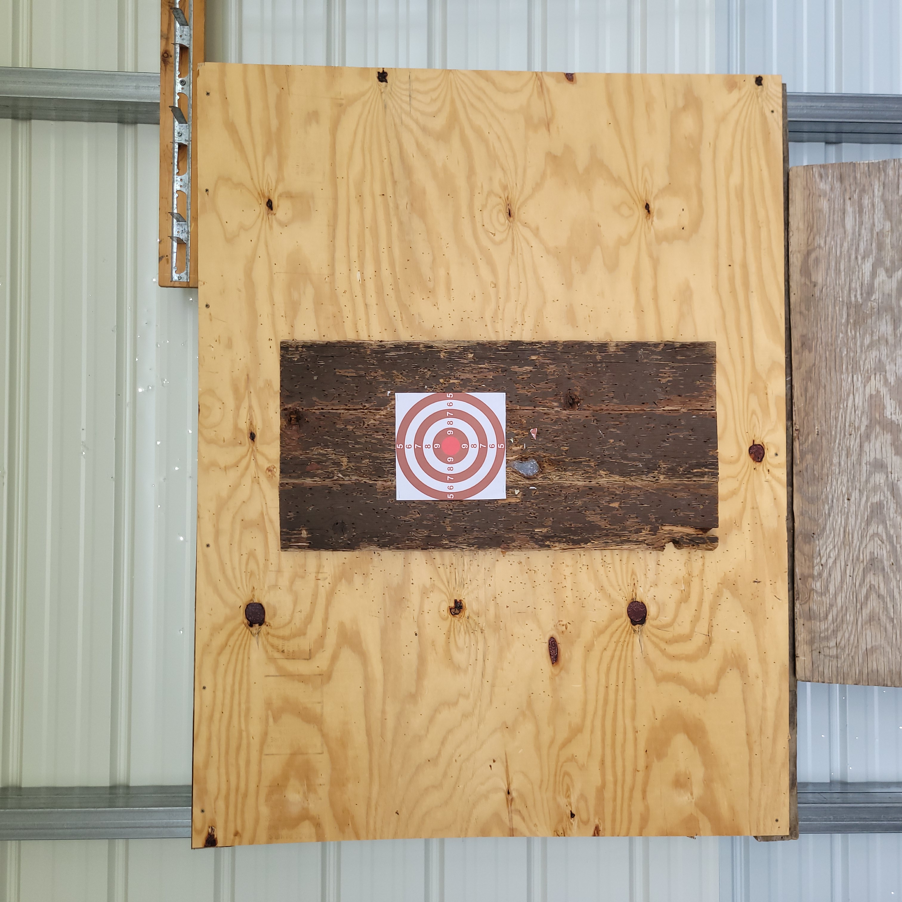
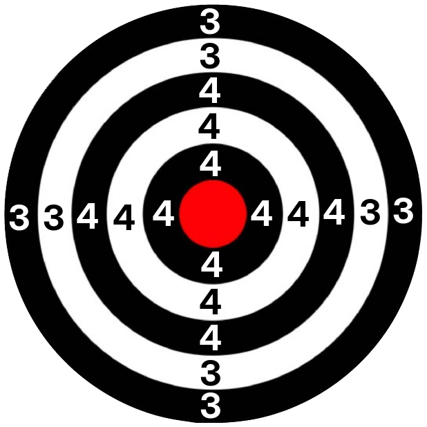

# Ninja Star Game

This is a score keeper for a ninja star throwing game. You throw the ninja 
stars in real life and use this web app to keep score.

## How to play (standard rules)

Each game consists of X rounds and Y players. For each round, every player 
gets 4 ninja star throws. For a throw to score, it must stick to the board for 
at least one second. For each game, each player gets one mulligan, which lets
them retry a single throw if they miss after a bad throw, without a penalty.
This web app does not track mulligans; therefore, this rule is optional and 
flexible.

## Scoring

In the setup used in the game that inspired this app, we had a target on a dark 
wood board on a larger, lighter-colored wood board.

- **Total miss or non-stick:** 0 points
- **Outer board:** 1 point
- **Inner board:** 2 points
- **Outer rings of target:** 3 points
- **Inner rings of target:** 4 points
- **Bullseye:** 7 points
- **_BONUS POINTS_ | Metal on metal** (ninja star hits a previously thrown ninja star from this round AND STICKS to the board)**:** +3 bonus points

If a different ninja star falls out after a new one is thrown, it does NOT 
subtract any points.

When a ninja star hits another ninja star, a metal-on-metal bonus is triggered.
Press the "+3 Metal-on-Metal" button ***before*** pressing the appropriate button for
the throw's score before the bonus point.

The maxiumum number of points possible to score in a 5-round game, assuming you
have four ninja stars and get four bullseyes, three of which are metal-on-metal, 
for all five rounds, is **185** points. The highest scoring 5-round 17ft game
anyone has gotten as of the writing of this document is **47** points.

For an intermediate experience level in a 5-round 17ft distance (class A) game:
- 0-10 is awful (but it's happened)
- 11-15 is bad
- 16-20 is meh
- 21-24 is okay
- 25-29 is good (average)
- 30-34 is great
- 35-39 is amazing
- 40-49 is insane
- 50+ is legendary (you're in the zone)

If you can consistently score 40+ points in a 5-round game 17 ft game, you 
should consider throwing from 20 ft; you're ready for the S-class leaderboard.

---

# Want to play the game yourself?
You'll need some wooden boards, ninja stars or throwing knifes, and a printable target.

Below is an image of our setup:

Your setup doesn't have to be exactly the same, but it should roughly match the shape and size.

And below is a printable target we use:

If printed full-width on a standard letter-sized paper, the target should exactly match what we use.
